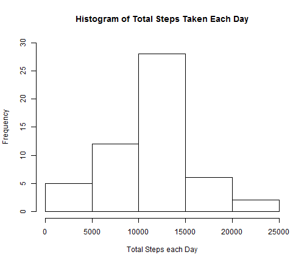
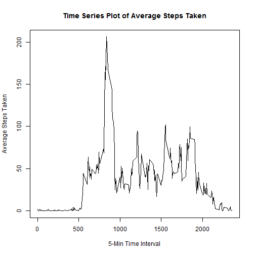
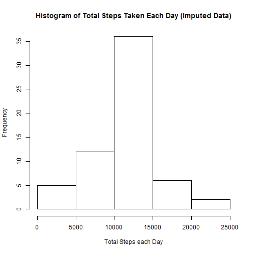
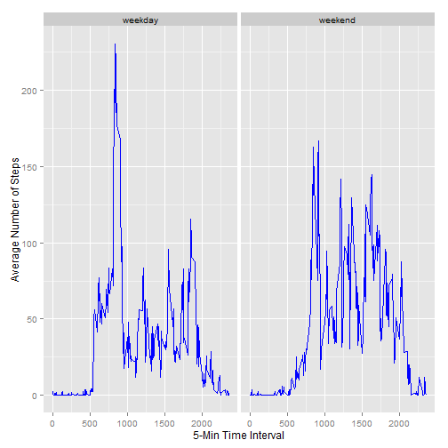

## Reproducible Research Peer Assignment 1

### Loading and Preprocessing the Data

1. Load the data


```r
df <- read.csv("activity.csv")
head(df)
```

```
##   steps       date interval
## 1    NA 2012-10-01        0
## 2    NA 2012-10-01        5
## 3    NA 2012-10-01       10
## 4    NA 2012-10-01       15
## 5    NA 2012-10-01       20
## 6    NA 2012-10-01       25
```

2. Process/transform the data (if necessary) into a format suitable for your analysis.

   No preprocessing is necessary at this stage; in later analysis, rows with missing data will be eliminated from the data frame.
   
### What is the mean total number of steps taken per day?

1. Calculate the total number of steps taken per day.

The following code shows the steps to compute the total number of steps per day, and it
omits the rows with NA's.


```r
library(dplyr)
```

```r
totsteps <- df %>%
  na.omit() %>%
  group_by( date ) %>%
  summarize( totalsteps=sum(steps) )

head( totsteps )
```

```
## Source: local data frame [6 x 2]
## 
##         date totalsteps
## 1 2012-10-02        126
## 2 2012-10-03      11352
## 3 2012-10-04      12116
## 4 2012-10-05      13294
## 5 2012-10-06      15420
## 6 2012-10-07      11015
```

2. Make a histogram of the total number of steps taken each day.


```r
hist( totsteps$totalsteps,
      ylim=c(0, 30),
      main="Histogram of Total Steps Taken Each Day", 
      xlab="Total Steps each Day" )
```

 

3. Calculate and report the mean and median of the total number of steps taken per day.


```r
mean( totsteps$totalsteps )
```

```
## [1] 10766.19
```

```r
median( totsteps$totalsteps )
```

```
## [1] 10765
```

The mean total number of steps taken is 10766.19 and it is very close to the median of 10765.

### What is the average daily activity pattern?

1. Make a time series plot of the 5-minute interval (x-axis) and the average number of steps taken, averaged across all days (y-axis).


```r
avgperint <- df %>%
  na.omit() %>%
  group_by( interval ) %>%
  summarize( avgsteps=mean( steps ) )

plot( avgperint$interval, avgperint$avgsteps, type="l",
  main="Time Series Plot of Average Steps Taken",
  ylab="Average Steps Taken",
  xlab="5-Min Time Interval" )
```

 

2. Which 5-min interval, on average across all the days in the dataset, contains the maximum number of steps?


```r
avgperint[ which(avgperint$avgsteps==max(avgperint$avgsteps)), ]$interval
```

```
## [1] 835
```

From the time series plot, we can see that the maximum average steps taken occurs at an interval somewhere between 0750 and 1000.  We compute the exact 5-min interval with the above code, and the answer is the 0835 interval, which does fall in the interval (0750, 1000).

### Imputing missing values

1. Calculate and report the total number of missing values in the dataset (i.e. the total number of rows with NA's)


```r
summary( df )
```

```
##      steps                date          interval     
##  Min.   :  0.00   2012-10-01:  288   Min.   :   0.0  
##  1st Qu.:  0.00   2012-10-02:  288   1st Qu.: 588.8  
##  Median :  0.00   2012-10-03:  288   Median :1177.5  
##  Mean   : 37.38   2012-10-04:  288   Mean   :1177.5  
##  3rd Qu.: 12.00   2012-10-05:  288   3rd Qu.:1766.2  
##  Max.   :806.00   2012-10-06:  288   Max.   :2355.0  
##  NA's   :2304     (Other)   :15840
```

From the summary of the dataset, we see that the missing values are found only in the "steps" column of the dataset, and there are 2304 rows with missing values (or NA).

2. Devise a strategy for filling in all the missing values in the dataset.

Our strategy is to fill in the missing values with the mean for that 5-min interval.

3. Create a new dataset that is equal to the original dataset but with the missing data filled in.


```r
merged<-merge( df, avgperint, by="interval")
imp_df <- merged %>%
    mutate( impsteps=ifelse( is.na(steps), avgsteps, steps) )  %>%
    select(-avgsteps)
summary( imp_df )
```

```
##     interval          steps                date          impsteps     
##  Min.   :   0.0   Min.   :  0.00   2012-10-01:  288   Min.   :  0.00  
##  1st Qu.: 588.8   1st Qu.:  0.00   2012-10-02:  288   1st Qu.:  0.00  
##  Median :1177.5   Median :  0.00   2012-10-03:  288   Median :  0.00  
##  Mean   :1177.5   Mean   : 37.38   2012-10-04:  288   Mean   : 37.38  
##  3rd Qu.:1766.2   3rd Qu.: 12.00   2012-10-05:  288   3rd Qu.: 27.00  
##  Max.   :2355.0   Max.   :806.00   2012-10-06:  288   Max.   :806.00  
##                   NA's   :2304     (Other)   :15840
```

4. Make a histogram of the total number of steps taken each day.  Calculate and report the mean and median of the total number of steps taken per day.


```r
imp_totsteps <- imp_df %>%
    group_by( date ) %>%
    summarize( totimpsteps=sum( impsteps ) )

hist( imp_totsteps$totimpsteps,
      main="Histogram of Total Steps Taken Each Day (Imputed Data)", 
      xlab="Total Steps each Day")
```

 


```r
mean( imp_totsteps$totimpsteps )
```

```
## [1] 10766.19
```

```r
median( imp_totsteps$totimpsteps )
```

```
## [1] 10766.19
```

The new mean of total steps taken each day is 10766.19 and median is 10766.19.  The mean remains the same as the mean that was calculated earlier, but now the new median is exactly the mean, whereas, the earlier median was 10765.  So, the impact of imputing missing data on the estimates of the total daily number of steps is to bring the mean and median closer.

### Are there differences in activity patterns between weekdays and weekends?

1. Create a new factor variable in the dataset with two levels - "weekday" and "weekend" indicating whether a given date is a weekday or weekend day.

We create a new factor named "whichday" as follows:


```r
impdf_newfactor <- imp_df %>%
     mutate( whichday=as.factor( ifelse( 
       ( weekdays(as.Date(date))=="Saturday" | weekdays(as.Date(date))=="Sunday" ), 
           "weekend", "weekday") ) )
```

2. Make a panel plot containing a time series plot of the 5-minute (x-axis) and the average number of steps taken, averaged across all weekday days or weekend days (y-axis).


```r
impdf_avg <- impdf_newfactor %>%
    group_by( whichday, interval ) %>%
    summarize( avgbydayint=mean( impsteps ) )

library(ggplot2)
h <- ggplot( impdf_avg, aes(interval, avgbydayint) )
h<-  h + geom_line( col="blue" )
h <- h + facet_wrap( ~ whichday)
h <- h + labs(x="5-Min Time Interval") + labs(y="Average Number of Steps") 
print(h)
```

 

Comparing the plots, we see that generally, there is more activity during the weekend than during weekdays, except for a noticeable spike of activity sometime between 0800 and 0900 interval on the weekday mornings.


   
   
   
